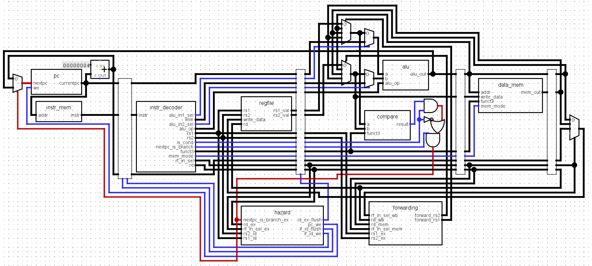

# bonato-2
Currently the v1 architecture (which only dealt with core, unprivileged, non-system instructions) is finished, and passes all tests. The v2 architecture (implementing Zicsr and the machine-level ISA) is a work in progress.

## The v1 architecture

It's a five-stage pipeline: fetch, decode, execute, memory access, and writeback. Originally, I wasn't sure what stages I should use, but this seemed like the standard across all the research I did and similar projects I looked at. Below is the diagram of the v1 architecture (you can find the logisim file in `/diagrams`), which supports the base instruction set excluding ecall and ebreak.

## Tests

Check `riscv-arch-test/config/cores/bonato` for testing configurations. Currently all tests pass for the v1. When running any make commands to test this yourself, make sure to run them with your current directory set to `riscv-arch-test`, since quite a few commands use relative paths starting there.

*Note*: the configuration files for the v1 were originally copied from the cv32e20, and then minimized as much as possible.
